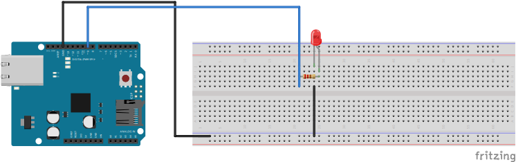

# Opdracht 1
**LED besturen met Arduino**

Met de eerste opdracht willen we kijken of jullie het lukt om een ledje te besturen met een Arduino

**Arduino**
1. Bouw het volgende schema op je breadboard en Arduino

2. Steek de Arduino in je laptop
3. Open de Arduino IDE
4. Selecteer de correcte port en board

5. In de Arduino IDE ga naar File > New Sketch

Maak nu een programma waarbij je het ledje op poort 9 van de Arduino kan besturen.

Maak hier gebruik van `pinMode()` waarbij je aangeeft dat poort `9` als `OUTPUT` fungeert (bijvoorbeeld `pinMode(9, OUTPUT)`) in de `setup()`.

In de `loop()` is het mogelijk om `digitalWrite()` te gebruiken, met daarbij het aangeven welke poort (in dit geval `9`) en of je de `OUTPUT` `HIGH` (voor aan) en `LOW` (voor uit) gebruikt (bijvoorbeeld `digitalWrite(9, HIGH)`).

6. Upload het programma naar je board

Indien je er niet uitkomt, is het mogelijk om in [opdracht-1](./opdracht-1.ino) te kijken voor de oplossing.
