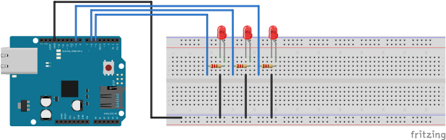

# Opdracht 2a
**Stoplicht maken**

Met deze opdracht willen we kijken of jullie het lukt om een stoplicht te maken met de Arduino
**Arduino**
1. Bouw het volgende schema op je breadboard en Arduino

2. Steek de Arduino in je laptop
3. Open de Arduino IDE
4. Selecteer de correcte port en board

5. In de Arduino IDE ga naar File > New Sketch

Maak nu een programma waarbij je de ledjes op poorten 5, 6 en 9 kunt besturen.

Maak wederom gebruik van `pinMode()` voor het opzetten van de poort in `setup()`

> Let op dat dit 3 maal moet gebeuren, voor elk ledje een `pinMode()`

In de loop is het weer mogelijk om `digitalWrite()` te gebruiken. Echter kun je dit dus vaker doen met ook andere pins. Daarbij kun je met `delay()` spelen om een stoplicht te simuleren. Tussen de `()` kun je aangeven hoeveel delay in `ms` het programma moet wachten op de volgende instructie. Gebruik voor de `digitalWrite()` dus weer de pin definitie en `HIGH` of `LOW` voor het aan- en uitzetten van het ledje.

6. Upload het programma naar je board

Indien je er niet uitkomt, is het mogelijk om in [opdracht-2a](./opdracht-2a.ino) te kijken voor de oplossing.