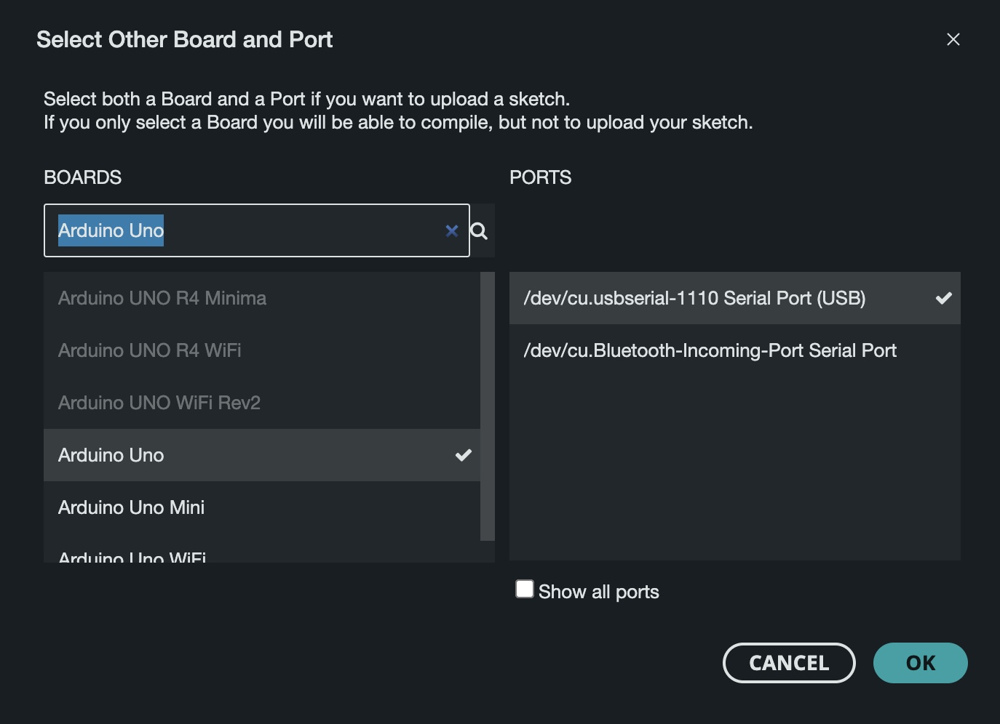
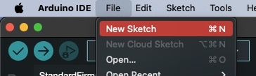

# Opdracht 2b
**LED met knop**

Met deze opdracht willen we kijken of jullie het lukt om een led te besturen met een fysieke knop.

**Arduino**
1. Bouw het volgende schema op je breadboard en Arduino

2. Steek de Arduino in je laptop
3. Open de Arduino IDE
4. Selecteer de correcte port en board

5. In de Arduino IDE ga naar File > New Sketch

Maak nu een programma waarbij je het ledje op poort 5 kunt aan en uitzetten met een knop.

> LET OP!: Om overzicht te houden wat welke pin doet, is het ook mogelijk om bovenin je bestand een pin te definieren met een naam, bijvoorbeeld `#define LED_PIN 5` of `#define BUTTON_PIN 7`

Gebruik weer `pinMode()` om je pins op te zettin in de `setup()`. Indien je gebruik maakt van de `#define` hoef je dus niet meer een nummer mee te geven maar een naam die je hebt gegeven aan de pin. Daarnaast moet de `BUTTON` ook een `pinMode()` krijgen. Echter zal deze niet `OUTPUT` gedefinieerd worden, maar als `INPUT_PULLUP`.

Nu de pins gedefinieerd zijn kan er met `digitalRead(BUTTON_PIN)` gekeken worden of de huidige staat van de pin `HIGH` of `LOW` is (knop ingedrukt zal `HIGH` geven). Op deze manier kan je zien wanneer de knop is ingedrukt en wanneer je het ledje aan of uitzet met `digitalWrite()`

6. Upload het programma naar je board

Indien je er niet uitkomt, is het mogelijk om in [opdracht-2b](./opdracht-2b.ino) te kijken voor de oplossing.