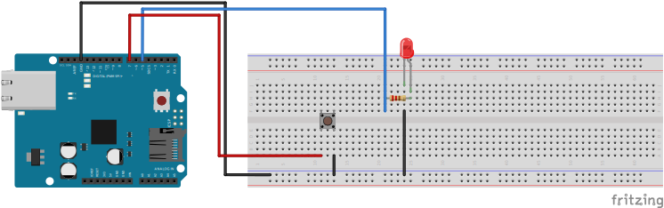
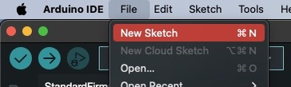

# Opdracht 2c
**LED met knop en status**

Met deze opdracht willen we kijken of jullie het lukt om een led te besturen met een fysieke knop, met daarbij het onthouden van de status.

**Arduino**
1. Bouw het volgende schema op je breadboard en Arduino. Dit is hetzelfde schema als **opdracht-2b**

2. Steek de Arduino in je laptop
3. Open de Arduino IDE
4. Selecteer de correcte port en board

5. In de Arduino IDE ga naar File > New Sketch

De opdracht is een uitbreiding op opdracht-2b.

Sla de status op van de knop en het ledje om een toggle te kunnen maken. Zo kan er boven de `setup()` een `byte` gedefinieerd worden met de ene `lastButtonState = LOW` en de andere `ledState = LOW`. In de `loop()` is het vervolgens mogelijk om de huidige staat van de knop op te slaan in een variabelen zoals `buttonState = digitalRead(BUTTON_PIN)`. Nu is het mogelijk om een nested `if` statement te maken, met daarbij de uitdaging om het ledje te toggelen van `HIGH` naar `LOW` en vice versa.

6. Upload het programma naar je board

Indien je er niet uitkomt, is het mogelijk om in [opdracht-2c](./opdracht-2c.ino) te kijken voor de oplossing.