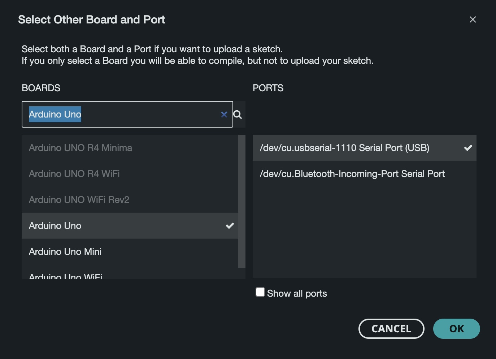
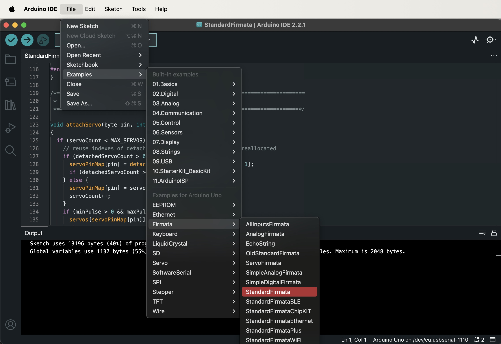

# Opdracht 3
## Part 1
**Arduino besturen met Node**

Nu alle vorige opdrachten zijn gedaan, kunnen we eens gaan kijken naar hoe we een Arduino kunnen besturen met JavaScript.

**Arduino**
1. Bouw het volgende schema op je breadboard en Arduino

2. Steek de Arduino in je laptop
3. Open de Arduino IDE
4. Selecteer de correcte port en board

5. In de Arduino IDE ga naar File > Examples > Firmata > Standardfirmata

6. Upload het programma naar je board

bouw breadboarb
steek arduino in
open arduino ide
selecteer correcte port en board
in arduino ide ga naar file > examples > firmata > standardfirmata
upload naar board

draai npm install
start node part1.js
rood ledje blinkt nu
stop met ctrl-c
start node part2.js
voer led.toggle() uit

hoera