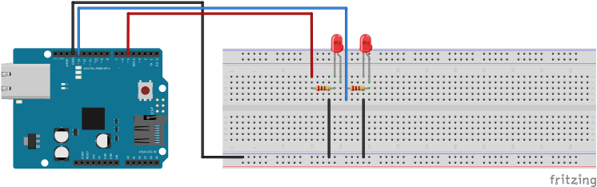

# Opdracht 3
## Part 1
**Arduino besturen met Node**

Nu alle vorige opdrachten zijn gedaan, kunnen we eens gaan kijken naar hoe we een Arduino kunnen besturen met JavaScript.

**Arduino**
1. Bouw het volgende schema op je breadboard en Arduino

2. Steek de Arduino in je laptop
3. Open de Arduino IDE
4. Selecteer de correcte port en board

5. In de Arduino IDE ga naar File > Examples > Firmata > Standardfirmata

6. Upload het programma naar je board


**Node app**
1. Open de terminal
2. Zorg dat je in de folder van opdracht-3 zit met `cd opdracht-3`
3. Run het command `npm install`
4. Run het command `node part1.js`

Nu het programma start is het de bedoeling dat het ledje die is ingestoken op poort 13 van de Arduino gaat knipperen met een 1000ms vertraging. Zo niet probeer de stappen nogmaals uit en kijk of dit de situatie verbeterd.

Om het volgende onderdeel uit te voeren is het volgende nodig.

1. Stop het huidige node programma met Ctrl-C
2. Run het command `node part2.js`

Als het programma gestart is, is het de bedoeling dat het ledje die is ingestoken op poort 13 van de Arduino continue blijft branden. Zo niet probeer de stappen nogmaals uit en kijk of dit de situatie verbeterd.

Op dit moment kan er met het ledje op poort 5 gespeeld worden. Zo kunnen de volgende commando's uitgevoerd worden.

```js
led.toggle()
led.off()
led.on()
led.blink(delay in ms)
led.pulse(delay in ms)
```

Met `blink` en `pulse` kan er gespeeld worden met hoe snel het effect uitgevoerd moet worden. Zo kan er tussen de `()` een waarde meegestuurd worden wat de delay is van het effect. Denk bijvoorbeeld aan 1000 voor een seconde of meer. Als er geen waarde meegestuurd wordt, gaat de snelheid naar zijn default en dat bedraagd 100ms. Als je het effect van `blink` of `pulse` wilt stoppen dien je `led.stop()` te sturen als command. Zo niet is het niet mogelijk om `toggle`, `on` of `off` te gebruiken.