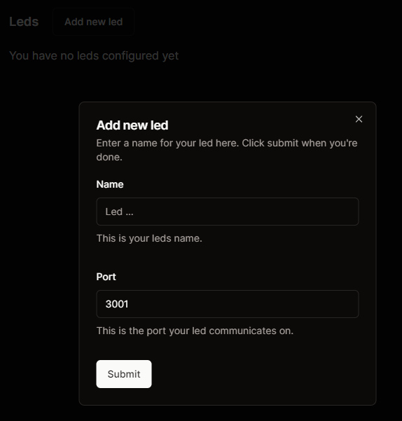
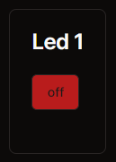
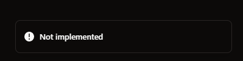

# Opdracht 4a

**Frontend**

Met deze opdracht willen we kijken of jullie het lukt om via een frontend de api van de server aan te spreken.

Start de frontend door:

- `npm install`
- `npm run dev`

We maken voor de frontend gebruik van Nextjs. Nextjs heeft een watcher ingebouwd wat betekend dat de aanpassingen die je maakt automatisch een recompile aanroepen.

Na het opstarten van de app kom je op de landingpage van de applicatie waar je door kan klikken naar het dashboard. In het dashboard kun je een nieuwe led toevoegen met de juiste port van je server.

In het dashboard staat al een opzet voor het toevoegen van nieuwe leds.

Zorg dat je de port van de server goed invult. De naam van de lamp maakt niet uit.

Voor het aansturen van de lamp gebruiken we een simpele knop.

Als je deze knop probeert te gebruiken zul je merken dat deze nog niet werkt.

**Request**

Nu hebben we een frontend applicatie voor het aansturen van een lamp heeft maar hoe krijgen we acties van de frontend naar de server van de led.
1. In het bestand `./led-api-calls.tsx` kun je functies vinden voor het aanroepen van een request. Roep met fetch het endpoint van de server aan.

Zorg dat je de juiste response terugkrijgt van de server zodat de knop groen wordt.