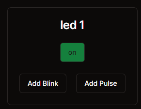

# Opdracht 4b

**Opdracht 4b**

Het is ook mogelijk om een led te laten knipperen of pulseren. Probeer nu zelf de functies ledPulse en ledBlink te maken en hieraan een interval mee te geven zodat de led gaat knipperen.



* In het bestand `Led.tsx` kun je de comment bij 4b weghalen en zelf de implementatie afmaken.
* Het bestand ``` led-api-calls.tsx ``` kun je verder uitbreiden met de functies ledPulse en ledBlink.

Let op dat je voor blink en pulse een interval mee moet geven in het request.
```ts 
Interval: number 
```

**Oplossing 4a**

Als je opdracht a nog niet werkend hebt is dit een mogelijke oplossing:

```ts
export async function ledOn(port: number) {
  return fetch("http://localhost:" + port + "/api/led-on", {
    method: "POST",
  });
}

export async function ledOff(port: number) {
  return fetch("http://localhost:" + port + "/api/led-off", {
    method: "POST",
  });
}
```
