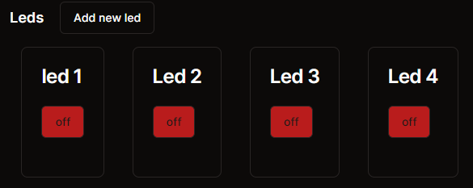

# Opdracht 4c

**Opdracht 4c Bonus**

Het is mogelijk om meerdere ledjes toe te voegen in het dashboard. Maar lukt het jullie ook om de applicaties om te schrijven dat je meerdere ledjes aan kunt sturen?

- Sluit meerdere ledjes aan op de arduino en probeer vanuit het dashboard ze individueel aan te sturen.



**Oplossing 4b**

Als je opdracht b nog niet werkend hebt is dit een oplossing:

```ts
export async function ledBlink(port: number, interval: number) {
  return fetch("http://localhost:" + port + "/api/led-blink", {
    method: "POST",
    body: JSON.stringify({ interval: interval }),
  });
}

export async function ledPulse(port: number, interval: number) {
  return fetch("http://localhost:" + port + "/api/led-pulse", {
    method: "POST",
    body: JSON.stringify({ interval: interval }),
  });
}
```

```ts
const ledBlinkMutation = useMutation({
  mutationFn: (interval: number) => ledBlink(led.port, interval),
  onSuccess: (data, interval) => {
    updateStatus({
      ...led,
      blink: true,
      pulse: false,
      blinkInterval: interval,
    });
    toast.success(data.text());
  },
  onError: (e) => {
    toast.error(e.message);
  },
});

const ledPulseMutation = useMutation({
  mutationFn: (interval: number) => ledPulse(led.port, interval),
  onSuccess: (data, interval) => {
    updateStatus({
      ...led,
      blink: false,
      pulse: true,
      pulseInterval: interval,
    });
    toast.success(data.text());
  },
  onError: (e) => {
    toast.error(e.message);
  },
});
```

```ts
onSubmitInterval={(interval) => ledBlinkMutation.mutate(interval)}

onSubmitInterval={(interval) => ledPulseMutation.mutate(interval)}
```
